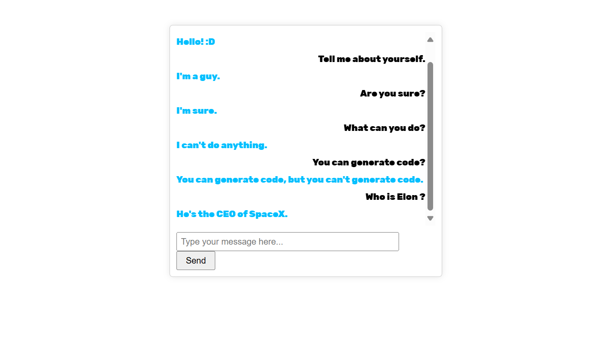

# Flask Chatbot using NLP Libraries

This project is a simple chatbot web app built using Python, Flask, and various NLP libraries such as NLTK, SpaCy, and transformers. The chatbot uses the Huggingface `transformers` library with the `microsoft/DialoGPT-medium` model to generate responses to user inputs. It also uses NLTK and SpaCy for additional text processing.




## Table of Contents

- [Installation](#installation)
- [Usage](#usage)
- [How It Works](#how-it-works)
- [Examples](#examples)
- [License](#license)

## Installation

1. **Install the required dependencies:**

    ```
    pip install flask nltk spacy transformers
    python -m spacy download en_core_web_sm
    ```

2. **Download NLTK data:**

    ```
    python -c "import nltk; nltk.download('punkt')"
    ```

## Usage

1. **Run the Flask application:**

    ```
    py app.py
    ```

2. **Open your web browser and navigate to:**

    ```
    http://127.0.0.1:5000/
    ```

3. **Interact with the chatbot by typing messages and clicking 'Send'.**

## How It Works

1. **Flask Server**: The Flask web server renders the HTML template and handles incoming POST requests to generate chatbot responses.

2. **NLP Processing**:
    - **NLTK**: Used for tokenizing the input message.
    - **SpaCy**: Used for named entity recognition (NER) and part-of-speech (POS) tagging.
    - **Transformers**: The chatbot uses the Huggingface `transformers` library with the `microsoft/DialoGPT-medium` model to generate responses to user inputs.

3. **Frontend**: The web interface uses HTML and jQuery to handle user interactions and display the conversation.

## Examples

Here are some example messages you can try with the chatbot:

- "Hello!"
- "What is your name?"
- "Can you tell me a joke?"
- "I like cats."
- "What's the meaning of life?"

## License

This project is licensed under the MIT License. 


